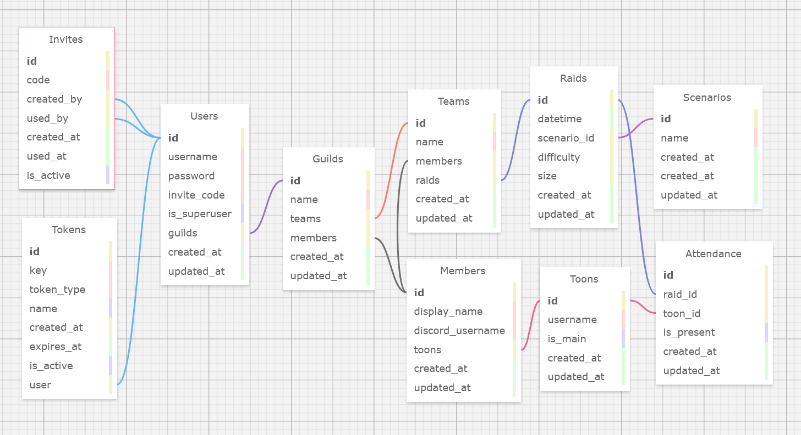

# GuildRoster

A FastAPI-based web and API application to manage and track your guild's roster across multiple teams in World of Warcraft.

## Table of Contents

- [Quick Start](#quick-start)
- [Features](#features)
- [Tech Stack](#tech-stack)
- [Password Authentication](#password-authentication)
- [Project Structure](#project-structure)
- [API Documentation](#api-documentation)
  - [Interactive Documentation](#interactive-documentation)
  - [Using the Interactive Docs](#using-the-interactive-docs)
  - [Documentation Features](#documentation-features)
- [API Endpoints](#api-endpoints)
  - [Health Check](#health-check)
  - [Users](#users)
  - [Tokens](#tokens)
  - [Guilds](#guilds)
  - [Teams](#teams)
- [Creating API Tokens](#creating-api-tokens)
- [User Authentication](#user-authentication)
  - [Creating a Superuser](#creating-a-superuser)
  - [User Login](#user-login)
  - [Password Security](#password-security)
- [Database Schema](#database-schema)
- [Development](#development)
  - [Prerequisites](#prerequisites)
  - [Environment Setup](#environment-setup)
  - [Testing](#testing)
  - [API Documentation Development](#api-documentation-development)
  - [Type Checking and Linting](#type-checking-and-linting)
  - [Database Migrations](#database-migrations)
  - [Logging](#logging)
- [Contributing](#contributing)
- [License](#license)

## Quick Start

```bash
# Clone and setup
git clone https://github.com/limsammy/guildroster.git
cd guildroster
pyenv virtualenv 3.13.5 guildroster
pyenv activate guildroster
pip install -r requirements.txt

# Configure environment
cp .env.example .env  # Edit with your settings

# Create your first superuser account
python scripts/create_superuser.py

# Create additional tokens for testing (optional)
python scripts/create_token.py --type system --name "Development Token"

# Run the app
uvicorn app.main:app --reload

# Run tests
pytest
```

- **API:** http://localhost:8000
- **Interactive Docs (Swagger UI):** http://localhost:8000/docs
- **Alternative Docs (ReDoc):** http://localhost:8000/redoc
- **OpenAPI Spec:** http://localhost:8000/openapi.json
- **Health Check:** http://localhost:8000

## Features

- **FastAPI REST API with automatic documentation**
  - Interactive Swagger UI at `/docs`
  - Professional ReDoc interface at `/redoc`
  - OpenAPI specification at `/openapi.json`
- PostgreSQL database with SQLAlchemy ORM
- Alembic migrations
- Comprehensive test suite with pytest
- **Secure password hashing** using PBKDF2 with SHA256 and automatic salting
- **Full API authentication** - All endpoints require valid tokens
- Token-based authentication system (user, system, and API tokens)
- User management with authentication-ready structure
- **Guild management** - Full CRUD operations with role-based access control
- **Team management** - Full CRUD operations with role-based access control
- **Member management** - Guild member profiles with team assignments
- **Toon management** - Character profiles for members with class, role, main/alt, and team assignment
- **Raid management** - Raid scheduling and tracking with difficulty, size, and team assignments
- **Scenario management** - Raid instance definitions with active/inactive status control
- **Attendance tracking** - Comprehensive raid attendance system with individual and bulk operations, filtering, statistics, and streak tracking
- **WarcraftLogs Integration** - Automatic participant extraction from WarcraftLogs reports with character name, class, spec, and role detection

## Tech Stack

- **Backend:** FastAPI, SQLAlchemy, PostgreSQL
- **Testing:** Pytest, TestClient
- **Migrations:** Alembic
- **Python:** 3.13.5

## Password Authentication

GuildRoster implements secure password authentication following industry best practices:

- **PBKDF2 Hashing**: All passwords are hashed using PBKDF2 with SHA256 and automatic salting
- **Secure Storage**: Only hashed passwords are stored in the database
- **Token-Based Access**: Successful authentication returns secure API tokens
- **Password Validation**: Minimum 8 characters with strength requirements
- **No Plain Text**: Passwords are never stored or transmitted in plain text

The authentication system integrates seamlessly with the existing token-based API security, providing both user authentication and API access control.

## Project Structure

```
app/
├── main.py          # FastAPI app entry point
├── config.py        # Environment configuration
├── database.py      # SQLAlchemy setup
├── models/          # Database models
├── schemas/         # Pydantic schemas
├── routers/         # API endpoints
└── utils/           # Utilities

scripts/
└── create_token.py  # Token creation utility

tests/
├── model/           # Model tests
├── unit/            # Unit tests
└── feature/         # Integration tests
```

## API Documentation

GuildRoster automatically generates comprehensive API documentation using FastAPI's built-in OpenAPI support.

### Interactive Documentation

- **Swagger UI**: http://localhost:8000/docs
  - Interactive API explorer
  - Try endpoints directly in your browser
  - Real-time request/response testing
  - Authentication support (Bearer tokens)

- **ReDoc**: http://localhost:8000/redoc
  - Professional documentation interface
  - Better for sharing with non-technical users
  - Clean, organized layout

- **OpenAPI Specification**: http://localhost:8000/openapi.json
  - Raw OpenAPI 3.0 specification
  - Used by API clients and tools
  - Machine-readable format

### Using the Interactive Docs

1. **Start the application**:
   ```bash
   uvicorn app.main:app --reload
   ```

2. **Create a token for testing**:
   ```bash
   python scripts/create_token.py --type system --name "API Testing"
   ```

3. **Access the docs**:
   - Visit http://localhost:8000/docs
   - Click the "Authorize" button (🔒 icon)
   - Enter your token: `Bearer YOUR_TOKEN_HERE`
   - Now you can test all endpoints interactively

### Documentation Features

✅ **Automatic Schema Generation** - All Pydantic models are documented  
✅ **Authentication Support** - Bearer token auth is fully integrated  
✅ **Request/Response Examples** - Auto-generated examples for all endpoints  
✅ **Validation Rules** - Shows required fields, data types, and constraints  
✅ **Error Responses** - All possible HTTP status codes are documented  
✅ **Always Up-to-Date** - Documentation matches your actual API code  

## API Endpoints

**Note:** All endpoints now require authentication. Use the token created in the setup steps.

### Health Check
- `GET /` - Health check (requires any valid token)

### Users
- `POST /users/` - Create new user (superuser only)
- `POST /users/login` - Authenticate user and get token
- `GET /users/` - List users (paginated, requires any valid token)
- `GET /users/{id}` - Get user by ID (requires any valid token)
- `GET /users/username/{username}` - Get user by username (requires any valid token)
- `PUT /users/{id}` - Update user (superuser only)
- `DELETE /users/{id}` - Delete user (superuser only)

### Tokens
- `POST /tokens/` - Create new token (superuser only)
- `GET /tokens/` - List tokens (superuser only)
- `GET /tokens/{id}` - Get token by ID (superuser only)
- `DELETE /tokens/{id}` - Delete token (superuser only)

### Guilds
- `POST /guilds/` - Create new guild (superuser only)
- `GET /guilds/` - List all guilds (any valid token)
- `GET /guilds/{guild_id}` - Get guild by ID (any valid token)
- `PUT /guilds/{guild_id}` - Update guild (superuser only)
- `DELETE /guilds/{guild_id}` - Delete guild (superuser only)

### Teams
- `POST /teams/` - Create new team (superuser only)
- `GET /teams/` - List all teams (any valid token)
- `GET /teams/{team_id}` - Get team by ID (any valid token)
- `GET /teams/guild/{guild_id}` - Get all teams for a guild (any valid token)
- `PUT /teams/{team_id}` - Update team (superuser only)
- `DELETE /teams/{team_id}` - Delete team (superuser only)

### Members
- `POST /members/` - Create new member (superuser only)
- `GET /members/` - List all members (any valid token)
- `GET /members/{member_id}` - Get member by ID (any valid token)
- `GET /members/guild/{guild_id}` - Get all members for a guild (any valid token)
- `GET /members/team/{team_id}` - Get all members for a team (any valid token)
- `PUT /members/{member_id}` - Update member (superuser only)
- `DELETE /members/{member_id}` - Delete member (superuser only)

### Toons
- `POST /toons/` - Create new toon (superuser only)
- `GET /toons/` - List all toons (any valid token)
- `GET /toons/{toon_id}` - Get toon by ID (any valid token)
- `GET /toons/member/{member_id}` - Get all toons for a member (any valid token)
- `PUT /toons/{toon_id}` - Update toon (superuser only)
- `DELETE /toons/{toon_id}` - Delete toon (superuser only)

### Raids
- `POST /raids/` - Create new raid (superuser only)
- `GET /raids/` - List all raids (any valid token)
- `GET /raids/{raid_id}` - Get raid by ID (any valid token)
- `GET /raids/team/{team_id}` - Get all raids for a team (any valid token)
- `GET /raids/scenario/{scenario_id}` - Get all raids for a scenario (any valid token)
- `PUT /raids/{raid_id}` - Update raid (superuser only)
- `DELETE /raids/{raid_id}` - Delete raid (superuser only)

### Scenarios
- `POST /scenarios/` - Create new scenario (superuser only)
- `GET /scenarios/` - List all scenarios (any valid token)
- `GET /scenarios/{scenario_id}` - Get scenario by ID (any valid token)
- `GET /scenarios/active` - Get all active scenarios (any valid token)
- `PUT /scenarios/{scenario_id}` - Update scenario (superuser only)
- `DELETE /scenarios/{scenario_id}` - Delete scenario (superuser only)

### Attendance
- `POST /attendance/` - Create new attendance record (superuser only)
- `POST /attendance/bulk` - Create multiple attendance records (superuser only)
- `GET /attendance/` - List attendance records with filtering (any valid token)
- `GET /attendance/{attendance_id}` - Get specific attendance record (any valid token)
- `GET /attendance/raid/{raid_id}` - Get all attendance for a raid (any valid token)
- `GET /attendance/toon/{toon_id}` - Get all attendance for a toon (any valid token)
- `GET /attendance/member/{member_id}` - Get all attendance for a member's toons (any valid token)
- `GET /attendance/team/{team_id}` - Get all attendance for a team (any valid token)
- `PUT /attendance/{attendance_id}` - Update attendance record (superuser only)
- `PUT /attendance/bulk` - Update multiple attendance records (superuser only)
- `DELETE /attendance/{attendance_id}` - Delete attendance record (superuser only)
- `GET /attendance/stats/raid/{raid_id}` - Get attendance statistics for a raid (any valid token)
- `GET /attendance/stats/toon/{toon_id}` - Get attendance statistics for a toon (any valid token)
- `GET /attendance/stats/member/{member_id}` - Get attendance statistics for a member (any valid token)
- `GET /attendance/stats/team/{team_id}` - Get attendance statistics for a team (any valid token)
- `GET /attendance/report/date-range` - Get attendance report for date range (any valid token)

## Attendance System

The attendance system provides comprehensive tracking of raid participation with powerful filtering, statistics, and reporting capabilities.

### Core Features

**Individual & Bulk Operations**
- Create single or multiple attendance records
- Update attendance status and notes
- Bulk operations support up to 100 records per request

**Flexible Filtering**
- Filter by raid, toon, member, team, or attendance status
- Date range filtering for historical analysis
- Multiple filter combinations supported

**Comprehensive Statistics**
- **Raid Stats**: Present/absent counts, attendance percentage
- **Toon Stats**: Individual character attendance tracking with streaks
- **Member Stats**: Combined attendance across all member's toons
- **Team Stats**: Team-wide attendance analysis

**Advanced Analytics**
- **Streak Tracking**: Current and longest attendance streaks
- **Attendance Reports**: Date range reports with detailed breakdowns
- **Performance Metrics**: Attendance percentages and trends

### Usage Examples

**Create Attendance Record**
```bash
curl -X POST http://localhost:8000/attendance/ \
  -H "Authorization: Bearer YOUR_TOKEN" \
  -H "Content-Type: application/json" \
  -d '{
    "raid_id": 1,
    "toon_id": 2,
    "is_present": true,
    "notes": "On time and ready"
  }'
```

**Bulk Create Attendance**
```bash
curl -X POST http://localhost:8000/attendance/bulk \
  -H "Authorization: Bearer YOUR_TOKEN" \
  -H "Content-Type: application/json" \
  -d '{
    "attendance_records": [
      {
        "raid_id": 1,
        "toon_id": 2,
        "is_present": true,
        "notes": "On time"
      },
      {
        "raid_id": 1,
        "toon_id": 3,
        "is_present": false,
        "notes": "No show"
      }
    ]
  }'
```

**Get Toon Statistics**
```bash
curl -X GET http://localhost:8000/attendance/stats/toon/2 \
  -H "Authorization: Bearer YOUR_TOKEN"
```

**Response:**
```json
{
  "total_raids": 10,
  "raids_attended": 8,
  "raids_missed": 2,
  "attendance_percentage": 80.0,
  "current_streak": 3,
  "longest_streak": 5,
  "last_attendance": "2024-01-15T20:00:00"
}
```

**Filter Attendance Records**
```bash
curl -X GET "http://localhost:8000/attendance/?team_id=1&is_present=true&start_date=2024-01-01T00:00:00&end_date=2024-01-31T23:59:59" \
  -H "Authorization: Bearer YOUR_TOKEN"
```

### Data Model

**Attendance Record Fields:**
- `id` - Unique identifier
- `raid_id` - Associated raid
- `toon_id` - Character who attended
- `is_present` - Whether the toon was present (true/false)
- `notes` - Optional notes about attendance
- `created_at` - Record creation timestamp
- `updated_at` - Last update timestamp

**Statistics Response:**
- `total_raids` - Total number of raids
- `raids_attended` - Number of raids attended
- `raids_missed` - Number of raids missed
- `attendance_percentage` - Percentage attendance rate
- `current_streak` - Current consecutive attendance streak
- `longest_streak` - Longest consecutive attendance streak
- `last_attendance` - Date of last attendance (if any)

## Creating API Tokens

Before testing the API, you need to create a token for authentication. Use the provided script:

```bash
# Create a system token for development/testing
python scripts/create_token.py --type system --name "Development Token"

# Create an API token for frontend applications
python scripts/create_token.py --type api --name "Frontend App"

# Create a user token (requires existing user ID)
python scripts/create_token.py --type user --user-id 1 --name "User Token"

# Create a token with expiration (30 days)
python scripts/create_token.py --type system --name "Temporary Token" --expires 30
```

The script will output the token key that you can use in your API requests.

## User Authentication

The application now supports secure user authentication with password hashing using bcrypt.

### Creating a Superuser

To create the first superuser account:

```bash
python scripts/create_superuser.py
```

This interactive script will:
- Prompt for username and password
- Hash the password securely using bcrypt
- Create a superuser account
- Generate an authentication token
- Display the token for API access

### User Login

Users can authenticate and get tokens via the login endpoint:

```bash
curl -X POST http://localhost:8000/users/login \
  -H "Content-Type: application/json" \
  -d '{
    "username": "your_username",
    "password": "your_password"
  }'
```

This returns:
```json
{
  "access_token": "your_token_here",
  "token_type": "bearer",
  "user_id": 1,
  "username": "your_username",
  "is_superuser": false
}
```

### Password Security

- **Hashing**: All passwords are hashed using PBKDF2 with SHA256 and automatic salting
- **Verification**: Password verification is done securely without storing plain text
- **Strength**: Passwords must be at least 8 characters long
- **Storage**: Only hashed passwords are stored in the database


## Database Schema

The application uses a relational database with the following core tables and relationships:



**Core Tables:**
- **Users** - Authentication and user management
- **Tokens** - API authentication for both users and frontend applications (supports user, system, and API token types)
- **Guilds** - Guild information and settings
- **Teams** - Team organization within guilds
- **Members** - Guild member profiles
- **Toons** - Character information for guild members (username, class, role, is_main, member_id, created_at, updated_at)
- **Raids** - Raid scheduling and tracking (scheduled_at, difficulty, size, team_id, scenario_id, created_at, updated_at)
- **Scenarios** - Raid instance definitions (name, is_active, created_at, updated_at)
- **Attendance** - Raid attendance records with presence tracking, notes, and statistics
- **Invites** - User registration system (planned)

**Key Relationships:**
- Users can belong to multiple guilds and have multiple tokens
- Tokens support user authentication, system operations, and frontend API access (with expiration and naming)
- Guilds are created by users and contain multiple teams and members
- Members can be assigned to teams and have guild-specific profiles
- Members can have multiple characters (toons)
- Teams can have multiple scheduled raids with different difficulties and sizes
- Raids are associated with specific scenarios for content tracking
- Scenarios can be active or inactive to control availability
- Invites control user registration and guild membership (planned)

## Development

### Prerequisites
- Python 3.13.5
- PostgreSQL
- pyenv (recommended)

### Environment Setup
Create a `.env` file with:
```env
DB_USER=guildroster
DB_PASSWORD=password
DB_HOST=localhost
DB_PORT=5432
DB_NAME=guildroster
SECRET_KEY=your-secret-key

# WarcraftLogs API Configuration
WARCRAFTLOGS_CLIENT_ID=your_client_id_here
WARCRAFTLOGS_CLIENT_SECRET=your_client_secret_here
```

#### WarcraftLogs API Setup

GuildRoster integrates with the [WarcraftLogs API](https://www.warcraftlogs.com/api/docs) to automatically fetch raid participant data from WarcraftLogs reports.

**To set up WarcraftLogs API access:**

1. **Create a WarcraftLogs API Application:**
   - Go to the [WarcraftLogs Client Management Page](https://www.warcraftlogs.com/api/clients/)
   - Click "Create Client"
   - Enter a client name (e.g., "GuildRoster")
   - **Leave redirect URIs blank** (not needed for client credentials flow)
   - Click "Create"

2. **Get Your Credentials:**
   - Copy your `Client ID` and `Client Secret`
   - Add them to your `.env` file as shown above

3. **Test the Integration:**
   ```bash
   # Interactive mode (recommended for first-time testing)
   python test_warcraftlogs.py --interactive
   
   # Command line testing
   python test_warcraftlogs.py --url "https://www.warcraftlogs.com/reports/YOUR_REPORT_CODE"
   
   # Test specific functionality
   python test_warcraftlogs.py --url "URL" --type participants
   python test_warcraftlogs.py --url "URL" --type fights
   ```

**What this enables:**
- ✅ Automatic participant extraction from WarcraftLogs reports
- ✅ Character name, class, spec, and role detection
- ✅ Integration with your existing toon/member system
- ✅ Public report access (no user authorization required)

**Note:** This uses the Client Credentials Flow, which provides access to all public WarcraftLogs data. No redirect URLs or user authorization are required.

#### Testing WarcraftLogs Integration

The project includes a comprehensive test script to verify your WarcraftLogs API integration. This script helps you:

- ✅ Verify your API credentials are working
- ✅ Test URL parsing functionality
- ✅ Fetch and display participant data from reports
- ✅ Fetch and display fight/encounter data
- ✅ Debug API issues before integrating with the main application

**Available Test Modes:**

1. **Interactive Mode** (Recommended for first-time testing):
   ```bash
   python test_warcraftlogs.py --interactive
   ```
   - Prompts for WarcraftLogs report URL
   - Lets you choose what to test (all, participants, or fights)
   - Provides step-by-step guidance

2. **Command Line Mode**:
   ```bash
   # Test everything with a specific report
   python test_warcraftlogs.py --url "https://www.warcraftlogs.com/reports/abc123def456"
   
   # Test only participant data
   python test_warcraftlogs.py --url "URL" --type participants
   
   # Test only fight data
   python test_warcraftlogs.py --url "URL" --type fights
   ```

3. **Basic Credential Test**:
   ```bash
   python test_warcraftlogs.py
   ```
   - Tests credentials and URL parsing without a real report
   - Shows setup instructions

**Sample Test Output:**

```
🔧 WarcraftLogs API Test - Interactive Mode
==================================================

📝 Enter WarcraftLogs report URL: https://www.warcraftlogs.com/reports/abc123def456

🔍 What would you like to test?
   1. All functionality
   2. Participants only
   3. Fights only

Enter your choice (1-3): 1

✅ WarcraftLogs credentials found
✅ URL parsing works correctly
✅ Extracted report code: abc123def456

📊 Fetching report metadata...
✅ Report metadata fetched successfully
   Title: Mythic Amirdrassil, the Dream's Hope
   Zone: Amirdrassil, the Dream's Hope
   Start Time: 1703123456789
   End Time: 1703126789012
   Owner: GuildName

👥 Fetching participant data...
✅ Found 20 participants
📋 Participant List:
    1. PlayerName1 (Death Knight - Level 70, ClassID: 6)
    2. PlayerName2 (Paladin - Level 70, ClassID: 2)
    3. PlayerName3 (Mage - Level 70, ClassID: 8)

⚔️ Fetching fight data...
✅ Found 8 fights
🗡️ Fight List:
    1. Fyrakk (Mythic) - ✅ Killed
    2. Tindral Sageswift (Mythic) - ✅ Killed
    3. Smolderon (Mythic) - ❌ 45.2%

🎉 All tests passed! WarcraftLogs integration is working correctly.
```

**Troubleshooting:**

- **"Credentials not found"**: Check your `.env` file has `WARCRAFTLOGS_CLIENT_ID` and `WARCRAFTLOGS_CLIENT_SECRET`
- **"URL parsing failed"**: Ensure the URL follows the format `https://www.warcraftlogs.com/reports/REPORT_CODE`
- **"API request failed"**: Verify your credentials are correct and the report is public
- **"No participants found"**: The report might be private or have no participant data

### Testing
```bash
# Run all tests
pytest

# With coverage
pytest --cov=app

# Fix import issues
PYTHONPATH=$(pwd) pytest
```

### API Documentation Development

When developing new endpoints, the documentation is automatically generated from your code:

- **Function docstrings** become endpoint descriptions
- **Pydantic models** become request/response schemas  
- **Type hints** become parameter documentation
- **Dependencies** (like auth) are automatically documented

Example:
```python
@router.get("/users/{user_id}", response_model=UserResponse)
def get_user(
    user_id: int,
    db: Session = Depends(get_db),
    current_token: Token = Depends(require_any_token),
):
    """
    Retrieve a specific user by ID.
    
    **Parameters:**
    - `user_id`: The unique identifier of the user
    
    **Returns:**
    - User object with all details
    
    **Authentication:**
    - Requires any valid token
    """
    # Implementation here
```

### Type Checking and Linting

This project uses [mypy](http://mypy-lang.org/) for static type checking. Due to the dynamic nature of SQLAlchemy ORM and Pydantic integration, some mypy errors (such as assignments to SQLAlchemy model fields, or passing ORM models to Pydantic schemas) are expected and safe to ignore. These are well-known false positives and do not affect runtime correctness.

If you see `# type: ignore` comments in the codebase, they are used only for these unavoidable cases. All other mypy errors should be fixed or reported.

### Database Migrations
```bash
# Generate migration
alembic revision --autogenerate -m "Description"

# Apply migration
alembic upgrade head
```

### Logging

The application uses a centralized logging utility that provides both console and file output with daily rotation.

**Usage:**
```python
from app.utils.logger import get_logger

logger = get_logger(__name__)

# Log levels
logger.debug("Debug information")
logger.info("General information")
logger.warning("Warning messages")
logger.error("Error messages")
logger.critical("Critical errors")
```

**Features:**
- **Console output** with colorized formatting
- **File output** with daily rotation (keeps 7 days of logs)
- **Structured format** with timestamp, level, module name, and message
- **Automatic log directory creation** (`logs/app.log`)

**Example output:**
```
INFO     | 2024-01-15 10:30:45 | app.main | Starting GuildRoster v0.1.0 in dev environment
WARNING  | 2024-01-15 10:30:46 | app.routers.user | User not found: unknown_user
ERROR    | 2024-01-15 10:30:47 | app.database | Database connection failed
```

## Contributing

1. Fork the repository
2. Create a feature branch
3. Add tests for new functionality
4. Ensure all tests pass
5. Submit a pull request

## License

TODO
